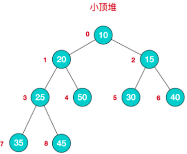
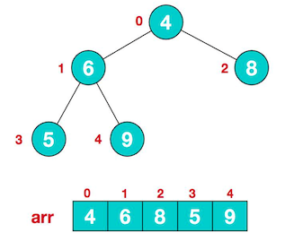
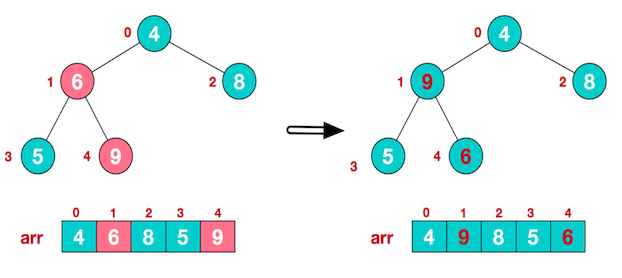
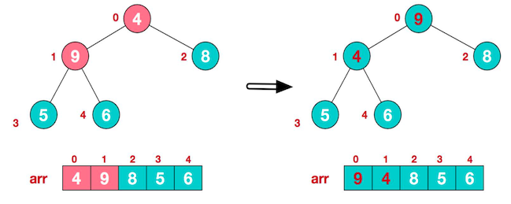
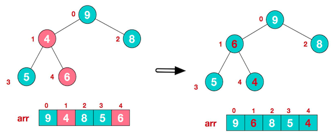
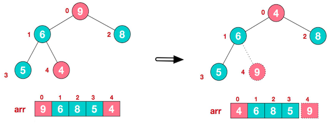
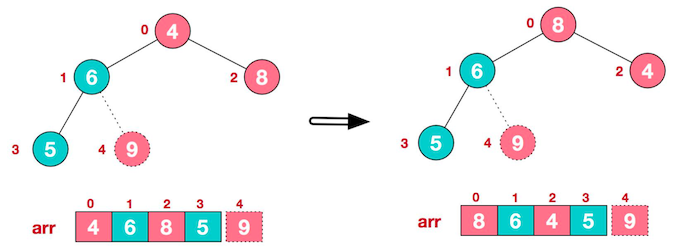
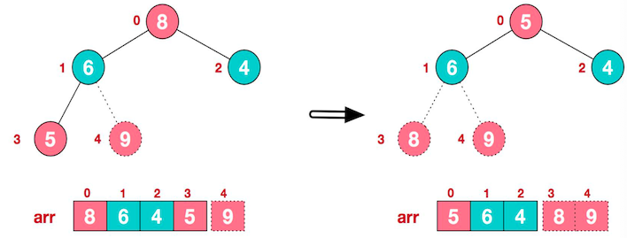
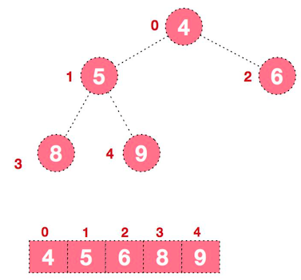

# 堆排序

> 堆排序整个流程可以总结为：`上浮下沉`


## 为什么解决本题需要用到堆？

> 很多同学可能会想到这样一种解决，我把数组全部排序好，这样就可以拿到第k大的元素，这样是一种解法，但是我们是需要第K大的元素，`不一定要全部排序好再去拿，只针对部分元素进行排序`，这样的复杂度显然可以降低的

也就是可以转化为：**使用堆排序来解决这个问题——建立一个大顶堆，做k−1 次删除操作后,堆顶元素就是我们要找的答案**`（堆排序过程中，不全部下沉，下沉`nums.length-k+1`,然后堆顶可以拿到我们top k答案了）` 


## 基本介绍

堆排序是利用 **堆** 这种 **数据结构** 而设计的一种排序算法，它是一种选择排序，最坏 、最好、平均时间复杂度均为 `O(nlogn)`，它是不稳定排序。

> 注意因为完全二叉树的性质，可以用数组表示对应的树结构（所以，堆排序过程中，你是看不到树这数据结构的，用数组进行映射了），这叫`顺序存储`

## 顺序存储二叉树

### 特点

- 第 n 个元素的 左子节点 为 **2*n+1**
- 第 n 个元素的 右子节点 为 **2*n+2**
- 第 n 个元素的 父节点 为 **(n-1)/2**
- 最后一个非叶子节点为 **Math.floor(arr.length/2)-1**

堆是具有以下性质的完全二叉树：

- 大顶堆：每个节点的值都 **大于或等于** 其左右孩子节点的值

  注：**没有要求左右值的大小关系**

- 小顶堆：每个节点的值都 **小于或等于** 其左右孩子节点的值

举例说明：

### 大顶堆举例


对堆中的节点按层进行编号，映射到数组中如下图


大顶堆特点：`arr[i] >= arr[2*i+1] && arr[i] >= arr[2*i+2]`，i 对应第几个节点，i 从 0 开始编号

### 小顶堆举例




小顶堆特点：`arr[i] <= arr[2*i+1] && arr[i] <= arr[2*i+2]`，i 对应第几个节点，i 从 0 开始

### 排序说明

- 升序：一般采用大顶堆
- 降序：一般采用小顶堆

## 基本思想

1. 将待排序序列构造成一个大顶堆

   注意：这里使用的是数组，而不是一颗二叉树

2. 此时：整个序列的 **最大值就是堆顶的根节点**

3. 将其 **与末尾元素进行交换**，此时末尾就是最大值

4. 然后将剩余 `n-1` 个元素重新构造成一个堆，这样 就会得到 n 个元素的次小值。如此反复，便能的得到一个有序序列。

## 堆排序步骤图解

对数组 `4,6,8,5,9` 进行堆排序，将数组升序排序。

### 步骤一：构造初始堆

1. 给定无序序列结构 如下：注意这里的操作用数组，树结构只是参考理解



  将给定无序序列构造成一个大顶堆。 

2. **此时从最后一个非叶子节点开始调整**，从左到右，从上到下进行调整。

  叶节点不用调整，第一个非叶子节点 `arr.length/2-1 = 5/2-1 = 1 `，也就是 元素为 6 的节点。

	比较时：先让 5 与 9 比较，得到最大的那个，再和 6 比较，发现 9 大于 6，则调整他们的位置。
  

3. 找到第二个非叶子节点 4，由于 `[4,9,8]` 中，9 元素最大，则 4 和 9 进行交换



4. 此时，交换导致了子根 `[4,5,6]` 结构混乱，将其继续调整。`[4,5,6]` 中 6 最大，将 4 与 6 进行调整。



此时，就将一个无序序列构造成了一个大顶堆。

### 步骤二：将堆顶元素与末尾元素进行交换

将堆顶元素与末尾元素进行交换，**使其末尾元素最大**。然后继续调整，再将堆顶元素与末尾元素交换，得到第二大元素。如此反复进行交换、重建、交换。

1. 将堆顶元素 9 和末尾元素 4 进行交换



2. 重新调整结构，使其继续满足堆定义



3. 再将堆顶元素 8 与末尾元素 5 进行交换，得到第二大元素 8



4. 后续过程，继续进行调整、交换，如此反复进行，最终使得整个序列有序



### 总结思路

1. 将无序序列构建成一个堆，根据升序降序需求选择大顶堆
2. 将堆顶元素与末尾元素交换，将最大元素「沉」到数组末端
3. 重新调整结构，使其满足堆定义，然后继续交换堆顶与当前末尾元素，反复执行调整、交换步骤，直到整个序列有序。


### 步骤

这里想说的几点注意事项（代码实现的关键思路）：

1. 第一步构建初始堆：**是自底向上构建，从最后一个非叶子节点开始**。

2. 第二步就是`下沉操作`让尾部元素与堆顶元素交换，**最大值被放在数组末尾**，并且缩小数组的length，不参与后面大顶堆的调整

3. 第三步就是`调整`：**是从上到下，从左到右**,因为堆顶元素下沉到末尾了，要重新调整这颗大顶堆


### 代码模板

> 官方的代码模板我参考了下，比一些书籍写的都好记，所以可以参考作为堆排序的模板

```javascript
/**
 * @param {number[]} nums
 * @param {number} k
 * @return {number}
 */
 // 整个流程就是上浮下沉
var findKthLargest = function(nums, k) {
   let heapSize=nums.length
    buildMaxHeap(nums,heapSize) // 构建好了一个大顶堆
    // 进行下沉 大顶堆是最大元素下沉到末尾
    for(let i=nums.length-1;i>=nums.length-k+1;i--){
        swap(nums,0,i)
        --heapSize // 下沉后的元素不参与到大顶堆的调整
        // 重新调整大顶堆
         maxHeapify(nums, 0, heapSize);
    }
    return nums[0]
   // 自下而上构建一颗大顶堆
   function buildMaxHeap(nums,heapSize){
     for(let i=Math.floor(heapSize/2)-1;i>=0;i--){
        maxHeapify(nums,i,heapSize)
     }
   }
   // 从左向右，自上而下的调整节点
   function maxHeapify(nums,i,heapSize){
       let l=i*2+1
       let r=i*2+2
       let largest=i
       if(l < heapSize && nums[l] > nums[largest]){
           largest=l
       }
       if(r < heapSize && nums[r] > nums[largest]){
           largest=r
       }
       if(largest!==i){
           swap(nums,i,largest) // 进行节点调整
           // 继续调整下面的非叶子节点
           maxHeapify(nums,largest,heapSize)
       }
   }
   function swap(a,  i,  j){
        let temp = a[i];
        a[i] = a[j];
        a[j] = temp;
   }
};
```

### 进行堆排序

```js
findKthLargest(nums,nums.length)
// 或者调整一下 let i=nums.length-1;i>=nums.length-k+1;的条件就行
```


## 复杂度

| 名称                  | 最佳情况          | 平均情况             | 最坏情况               | 内存      | 稳定性    | 备注      |
| --------------------- | :-------------: | :-----------------: | :-----------------: | :-------: | :-------: | :-------- |
| **堆排序**             | n&nbsp;log(n)   | n&nbsp;log(n)       | n&nbsp;log(n)       | 1         | 否        |           |

## 参考资料

[维基百科](https://en.wikipedia.org/wiki/Heapsort)