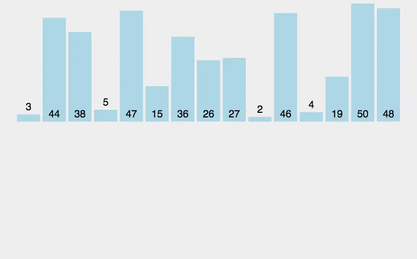

# 插入排序

插入排序（Insertion Sort）是一种简单直观的排序算法。它的工作原理是通过构建有序序列，在未排序的部分中从后向前逐步扫描，找到合适位置并插入元素。插入排序通常采用原地排序（只使用O(1)的额外空间），因此在扫描过程中需要反复将已排序元素向后移动，为新元素提供插入空间。

##  基本思想

> 插入排序的基本思想是将数组分为已排序和未排序两部分，初始时已排序部分只包含第一个元素，然后依次将未排序部分的元素插入到已排序部分的正确位置，直到所有元素都有序为止。

##  实现逻辑

1.  从第一个元素开始，将其视为已排序部分。
2.  取出下一个元素，从后向前扫描已排序部分，找到插入位置。
3.  如果当前元素大于被比较元素，则将被比较元素向后移动一位。
4.  重复步骤3，直到找到插入位置。
5.  将当前元素插入到插入位置后。
6.  重复步骤2~5，直到所有元素都插入到已排序部分。

## 动图演示


## 性能分析

*   平均时间复杂度：O(n^2)
*   最坏时间复杂度：O(n^2)
*   空间复杂度：O(1)
*   排序方式：In-place
*   稳定性：稳定排序算法

##  代码实现

```javascript
// 插入排序
function insertionSort(arr) {
  const len = arr.length;
  for (let i = 1; i < len; i++) {
    let current = arr[i];
    let j = i - 1;
    while (j >= 0 && arr[j] > current) {
      arr[j + 1] = arr[j];
      j--;
    }
    arr[j + 1] = current;
  }
}
```




[来源](https://visualgo.net/zh)

> 本来自己想写一个，可是太费时间了，外面找了一圈，发现有了，就拿来演示一下

## 算法优化改进

### 改进方法① - 二分插入排序

二分插入排序是对直接插入排序的改进，使用二分查找来找到插入位置，从而减少比较的次数。

改进代码：

```javascript
// 二分插入排序
function binaryInsertionSort(arr) {
  const len = arr.length;
  for (let i = 1; i < len; i++) {
    let current = arr[i];
    let left = 0;
    let right = i - 1;
    while (left <= right) {
      let middle = Math.floor((left + right) / 2);
      if (arr[middle] > current) {
        right = middle - 1;
      } else {
        left = middle + 1;
      }
    }
    for (let j = i - 1; j >= left; j--) {
      arr[j + 1] = arr[j];
    }
    arr[left] = current;
  }
}
```

### 改进方法② - 希尔排序

希尔排序是对插入排序的进一步改进，通过将数组分成多个子序列进行插入排序，逐渐缩小子序列的间隔，最终实现全局的排序。

***

***

## 复杂度

| 名称                  | 最佳情况          | 平均情况             | 最坏情况               | 内存      | 稳定性    | 备注      |
| --------------------- | :-------------: | :-----------------: | :-----------------: | :-------: | :-------: | :-------- |
| **插入排序**          | n               | n<sup>2</sup>       | n<sup>2</sup>       | 1         | 是       |           |

## 参考资料

[维基百科](https://en.wikipedia.org/wiki/Insertion_sort)