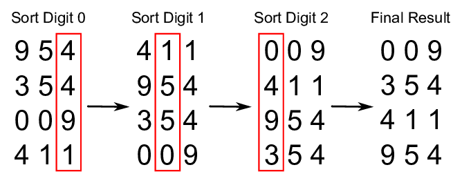

# 基数排序

在计算机科学中，**基数排序**（Radix Sort）是一种非比较的整数排序算法，它通过将具有相同有效位置和值的数字按位进行分组来排序具有整数键的数据。这需要使用位数制表示法，但由于整数可以表示字符串（例如，名称或日期）和特定格式的浮点数，因此基数排序不仅限于整数。

*名称的由来*

在数学的数字系统中，基数或底数是用于表示位置制数字系统中的数字的唯一数字的数量，包括数字零。例如，二进制系统（使用数字0和1）的基数为2，十进制系统（使用数字0到9）的基数为10。

## 效率

基数排序与其他排序算法相比的效率问题有些棘手，并且容易引起很多误解。基数排序是否与最佳的基于比较的排序算法同样高效、低效还是更高效，取决于所做的具体假设。对于具有单词大小 `w` 的整数键的 `n` 个键，基数排序的复杂度为 `O(wn)`。有时将 `w` 视为常数，这将使基数排序（对于足够大的 `n`）优于最佳的基于比较的排序算法，因为所有这些排序算法对 `n` 个键进行排序时执行的比较次数为 `O(n log n)`。然而，一般来说，`w` 不能被视为常数：如果所有的 `n` 个键都是不同的，那么为了能够在内存中存储它们，`w` 必须至少为 `log n`，这最多可以给出时间复杂度为 `O(n log n)`。这似乎使基数排序最多与最佳的基于比较的排序算法同样高效（如果键比 `log n` 长很多，则效率会更低）。

## 复杂度

| 名称                  | 最佳情况          | 平均情况             | 最坏情况               | 内存      | 稳定性    | 备注      |
| --------------------- | :-------------: | :-----------------: | :-----------------: | :-------: | :-------: | :-------- |
| **基数排序**          | n * k           | n * k               | n * k               | n + k     | 是       | k - 最长键的长度 |

## 参考资料

- [维基百科](https://en.wikipedia.org/wiki/Radix_sort)
- [YouTube](https://www.youtube.com/watch?v=XiuSW_mEn7g&index=62&t=0s&list=PLLXdhg_r2hKA7DPDsunoDZ-Z769jWn4R8)
- [ResearchGate](https://www.researchgate.net/figure/Simplistic-illustration-of-the-steps-performed-in-a-radix-sort-In-this-example-the_fig1_291086231)