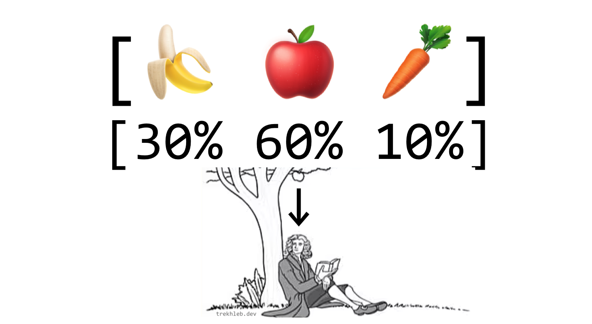

# 加权随机



## 什么是"加权随机"

假设你有一个**项目列表**。项目可以是任何东西。例如，我们可能有一个喜欢吃的水果和蔬菜列表：`[ '🍌', '🍎', '🥕' ]`。

**权重列表**表示每个项目的权重（或概率、重要性）。权重是数字。例如，权重列表 `[3, 7, 1]` 可以表示：

- 你更喜欢吃`🍎苹果`（`7`次中的`3`次+`7`次+`1`次中的`11`次），
- 然后你不太喜欢吃香蕉`🍌`（只有`11`次中的`3`次），
- 而你真的不喜欢胡萝卜`🥕`（只想吃`11`次中的`1`次）。

> 如果我们以概率为基础来讲，那么权重列表可能是一个总和为`1`的浮点数数组（例如`[0.1, 0.5, 0.2, 0.2]`）。

**加权随机**是一个函数，它会根据每个项目的权重随机返回列表中的一个项目，使得权重较大的项目更容易被选中。

函数的示例接口：

```javascript
const items =   [ '🍌', '🍎', '🥕' ];
const weights = [  3,    7,    1  ];

function weightedRandom(items, weights) {
  // 实现代码在这里...
}

const nextSnackToEat = weightedRandom(items, weights); // 可能是 '🍎'
```

## 加权随机的应用

- 在[遗传算法](https://en.wikipedia.org/wiki/Genetic_algorithm)中，加权随机用于"选择"阶段，当我们需要根据个体的适应度评分选择最适应/最强大的个体进行交配，并产生下一代更强大的个体。你可以在[500行代码中构建自动停车汽车](https://trekhleb.dev/blog/2021/self-parking-car-evolution/)文章中找到一个**示例**。
- 在[循环神经网络(RNN)](https://en.wikipedia.org/wiki/Recurrent_neural_network)中，当根据下一个字母的概率来决定下一个要选择的字母（以形成句子）时使用加权随机。你可以在[使用循环神经网络（RNN）生成食谱](https://nbviewer.org/github/trekhleb/machine-learning-experiments/blob/master/experiments/recipe_generation_rnn/recipe_generation_rnn.ipynb)的Jupyter笔记本中找到一个**示例**。
- 在[Nginx负载均衡](https://docs.nginx.com/nginx/admin-guide/load-balancer/http-load-balancer/)中，为了将HTTP请求更频繁地发送到权重较高的服务器。
- 等等...

## 算法

**直接的方法**如下：

1. 根据权重重复列表中的每个项目。
2. 从列表中随机选择一个项目。

例如，在水果和蔬菜的情况下，我们可以生成大小为`3 + 7 + 1 = 11`的以下列表：

```javascript
const items =   [ '🍌', '🍎', '🥕' ];
const weights = [  3,    7,    1  ];

// 根据权重重复项目。
const weightedItems = [
  '🍌', '🍌', '🍌',
  '🍎', '🍎', '🍎', '🍎', '🍎', '🍎', '🍎',
  '🥕',
];

// 现在只需从weightedItems数组中随机选择项目。
```

然而，正如你所看到的，这种方法可能需要大量的内存，特别是当我们需要在`weightedItems`列表中重复很多项目时。想象一下，如果你需要将一个字符串如`"some-random-string"`（`18`个字节）重复十亿次。你将需要额外分配大约`180Mb`的内存空间来存储这个数组。

**更高效的方法**如下：

1. 准备每个项目的累积权重列表（即`cumulativeWeights`列表，该列表将与原始的`weights`列表具有相同数量的元素）。在我们的例子中，它将如下所示：`cumulativeWeights = [3, 3 + 7, 3 + 7 + 1] = [3, 10, 11]`。
2. 生成从`0`到最大累积权重值的随机数`randomNumber`。在我们的例子中，随机数将在`[0..11]`的范围内。假设我们有`randomNumber = 8`。
3. 从左到右遍历`cumulativeWeights`列表，并选择第一个大于或等于`randomNumber`的元素。我们将使用这个元素的索引从`items`数组中选择项目。

这种方法的思想是，较高的权重将占据更多的数值空间。因此，随机数落入"较高权重数字桶"的可能性更高。

```javascript
const weights =           [3, 7,  1 ];
const cumulativeWeights = [3, 10, 11];

// 以伪代码的方式，我们可以这样考虑cumulativeWeights数组。
const pseudoCumulativeWeights = [
  1, 2, 3,               // <-- [3]个数字
  4, 5, 6, 7, 8, 9, 10,  // <-- [7]个数字
  11,                    // <-- [1]个数字
];
```


例：

```javascript
/**
 * 根据权重选择随机项目。
 * 权重较大的项目将被更频繁地选择（具有较高的概率）。
 *
 * 例如：
 * - items = ['banana', 'orange', 'apple']
 * - weights = [0, 0.2, 0.8]
 * - weightedRandom(items, weights) 在80%的情况下返回'apple'，
 *   在20%的情况下返回'orange'，它永远不会返回'banana'（因为选择香蕉的概率为0%）
 *
 * @param {any[]} items
 * @param {number[]} weights
 * @returns {{item: any, index: number}}
 */
export default function weightedRandom(items, weights) {
  if (items.length !== weights.length) {
    throw new Error('Items and weights must be of the same size');
  }

  if (!items.length) {
    throw new Error('Items must not be empty');
  }

  // 准备累积权重数组。
  // 例如：
  // - weights = [1, 4, 3]
  // - cumulativeWeights = [1, 5, 8]
  const cumulativeWeights = [];
  for (let i = 0; i < weights.length; i += 1) {
    cumulativeWeights[i] = weights[i] + (cumulativeWeights[i - 1] || 0);
  }

  // 在范围[0...sum(weights)]内获取随机数
  // 例如：
  // - weights = [1, 4, 3]
  // - maxCumulativeWeight = 8
  // - 随机数的范围是[0...8]
  const maxCumulativeWeight = cumulativeWeights[cumulativeWeights.length - 1];
  const randomNumber = maxCumulativeWeight * Math.random();

  // 根据权重选择随机项目。
  // 权重较大的项目将被更频繁地选择。
  for (let itemIndex = 0; itemIndex < items.length; itemIndex += 1) {
    if (cumulativeWeights[itemIndex] >= randomNumber) {
      return {
        item: items[itemIndex],
        index: itemIndex,
      };
    }
  }
}
```

## 实现

- 可以在[weightedRandom.js](weightedRandom.js)文件中找到`weightedRandom()`函数的实现。
- 可以在[__test__/weightedRandom.test.js](__test__/weightedRandom.test.js)文件中找到测试用例。
