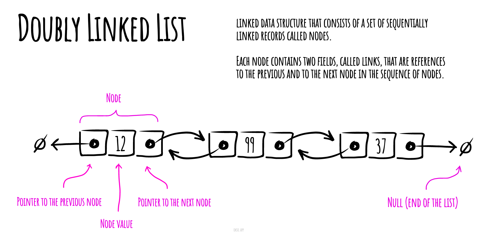

# 双向链表

在计算机科学中, 一个 **双向链表(doubly linked list)** 是由一组称为节点的顺序链接记录组成的链接数据结构。每个节点包含两个字段，称为链接，它们是对节点序列中上一个节点和下一个节点的引用。开始节点和结束节点的上一个链接和下一个链接分别指向某种终止节点，通常是前哨节点或null，以方便遍历列表。如果只有一个前哨节点，则列表通过前哨节点循环链接。它可以被概念化为两个由相同数据项组成的单链表，但顺序相反。



*Made with [okso.app](https://okso.app)*

两个节点链接允许在任一方向上遍历列表。

在双向链表中进行添加或者删除节点时,需做的链接更改要比单向链表复杂得多。这种操作在单向链表中更简单高效,因为不需要关注一个节点（除第一个和最后一个节点以外的节点）的两个链接,而只需要关注一个链接即可。

## 实现双向链表

### Comparator

```js
export default class Comparator {
  /**
   * 构造函数.
   * @param {function(a: *, b: *)} [compareFunction] - 可以是自定义的比较函数，该函数可以比较自定义的对象.
   */
  constructor(compareFunction) {
    this.compare = compareFunction || Comparator.defaultCompareFunction;
  }

  /**
   * 默认比较函数。假设 "a" 和 "b" 是字符串或数字。
   * @param {(string|number)} a
   * @param {(string|number)} b
   * @returns {number}
   */
  static defaultCompareFunction(a, b) {
    if (a === b) {
      return 0;
    }

    return a < b ? -1 : 1;
  }

  /**
   * 检查两个变量是否相等。
   * @param {*} a
   * @param {*} b
   * @return {boolean}
   */
  equal(a, b) {
    return this.compare(a, b) === 0;
  }

  /**
   * 检查变量 "a" 是否小于 "b"。
   * @param {*} a
   * @param {*} b
   * @return {boolean}
   */
  lessThan(a, b) {
    return this.compare(a, b) < 0;
  }

  /**
   * 检查变量 "a" 是否大于 "b"。
   * @param {*} a
   * @param {*} b
   * @return {boolean}
   */
  greaterThan(a, b) {
    return this.compare(a, b) > 0;
  }

  /**
   * 检查变量 "a" 是否小于或等于 "b"。
   * @param {*} a
   * @param {*} b
   * @return {boolean}
   */
  lessThanOrEqual(a, b) {
    return this.lessThan(a, b) || this.equal(a, b);
  }

  /**
   * 检查变量 "a" 是否大于或等于 "b"。
   * @param {*} a
   * @param {*} b
   * @return {boolean}
   */
  greaterThanOrEqual(a, b) {
    return this.greaterThan(a, b) || this.equal(a, b);
  }

  /**
   * 反转比较顺序。
   */
  reverse() {
    const compareOriginal = this.compare;
    this.compare = (a, b) => compareOriginal(b, a);
  }
}
```

### DoublyLinkedListNode

```js

export default class DoublyLinkedListNode {
  constructor(value, next = null, previous = null) {
    this.value = value;
    this.next = next;
    this.previous = previous;
  }

  toString(callback) {
    return callback ? callback(this.value) : `${this.value}`;
  }
}
```


### DoublyLinkedList

```js
export default class DoublyLinkedList {
  /**
   * @param {Function} [comparatorFunction]
   */
  constructor(comparatorFunction) {
    /** @var DoublyLinkedListNode */
    // 双向链表的头节点
    this.head = null;

    /** @var DoublyLinkedListNode */
    // 双向链表的尾节点
    this.tail = null;

    // 用于比较的函数
    this.compare = new Comparator(comparatorFunction);
  }

  /**
   * @param {*} value
   * @return {DoublyLinkedList}
   */
  // 将新的节点插入到头部
  prepend(value) {
    // 创建新的节点作为头部节点
    const newNode = new DoublyLinkedListNode(value, this.head);

    // 如果存在头部节点，那么它不再是头部节点了。
    // 因此，将其前驱节点设置为新节点（新的头部节点）。
    // 然后标记新的节点为头部节点。
    if (this.head) {
      this.head.previous = newNode;
    }
    this.head = newNode;

    // 如果还没有尾部节点，那么就让新的节点成为尾部节点。
    if (!this.tail) {
      this.tail = newNode;
    }

    return this;
  }

  /**
   * @param {*} value
   * @return {DoublyLinkedList}
   */
  // 将新的节点追加到尾部
  append(value) {
    const newNode = new DoublyLinkedListNode(value);

    // 如果还没有头部节点，让新的节点成为头部节点。
    if (!this.head) {
      this.head = newNode;
      this.tail = newNode;

      return this;
    }

    // 将新的节点添加到链表的末尾。
    this.tail.next = newNode;

    // 将当前尾部节点添加到新节点的前驱引用。
    newNode.previous = this.tail;

    // 设置新节点为链表的尾部节点。
    this.tail = newNode;

    return this;
  }

  /**
   * @param {*} value
   * @return {DoublyLinkedListNode}
   */
  // 删除具有特定值的节点
  delete(value) {
    if (!this.head) {
      return null;
    }

    let deletedNode = null;
    let currentNode = this.head;

    while (currentNode) {
      if (this.compare.equal(currentNode.value, value)) {
        deletedNode = currentNode;

        if (deletedNode === this.head) {
          // 如果要删除的是头部节点...

          // 将头部节点设置为第二个节点，它将成为新的头部节点。
          this.head = deletedNode.next;

          // 将新头部节点的前驱设置为 null。
          if (this.head) {
            this.head.previous = null;
          }

          // 如果链表中的所有节点的值都和传入的参数相同
          // 那么所有节点都会被删除，因此需要更新尾部节点。
          if (deletedNode === this.tail) {
            this.tail = null;
          }
        } else if (deletedNode === this.tail) {
          // 如果要删除的是尾部节点...

          // 将尾部节点设置为倒数第二个节点，它将成为新的尾部节点。
          this.tail = deletedNode.previous;
          this.tail.next = null;
        } else {
          // 如果要删除的是中间节点...
          const previousNode = deletedNode.previous;
          const nextNode = deletedNode.next;

          previousNode.next = nextNode;
          nextNode.previous = previousNode;
        }
      }

      currentNode = currentNode.next;
    }

    return deletedNode;
  }

  /**
   * @param {Object} findParams
   * @param {*} findParams.value
   * @param {function} [findParams.callback]
   * @return {DoublyLinkedListNode}
   */
  // 查找具有特定值或满足回调函数的节点
  find({ value = undefined, callback = undefined }) {
    if (!this.head) {
      return null;
    }

    let currentNode = this.head;

    while (currentNode) {
      // 如果指定了回调函数，那么尝试通过回调函数找到节点。
      if (callback && callback(currentNode.value)) {
        return currentNode;
      }

      // 如果指定了值，那么尝试通过值找到节点。
      if (value !== undefined && this.compare.equal(currentNode.value, value)) {
        return currentNode;
      }

      currentNode = currentNode.next;
    }

    return null;
  }

  /**
   * @return {DoublyLinkedListNode}
   */
  // 删除尾部节点
  deleteTail() {
    if (!this.tail) {
      // 没有尾部节点可以删除
      return null;
    }

    if (this.head === this.tail) {
      // 链表中只有一个节点
      const deletedTail = this.tail;
      this.head = null;
      this.tail = null;

      return deletedTail;
    }

    // 如果链表中有很多节点...
    const deletedTail = this.tail;

    this.tail = this.tail.previous;
    this.tail.next = null;

    return deletedTail;
  }

  /**
   * @return {DoublyLinkedListNode}
   */
  // 删除头部节点
  deleteHead() {
    if (!this.head) {
      return null;
    }

    const deletedHead = this.head;

    if (this.head.next) {
      this.head = this.head.next;
      this.head.previous = null;
    } else {
      this.head = null;
      this.tail = null;
    }

    return deletedHead;
  }

  /**
   * @return {DoublyLinkedListNode[]}
   */
  // 将链表转换为数组
  toArray() {
    const nodes = [];

    let currentNode = this.head;
    while (currentNode) {
      nodes.push(currentNode);
      currentNode = currentNode.next;
    }

    return nodes;
  }

  /**
   * @param {*[]} values - 需要转换为链表的值的数组。
   * @return {DoublyLinkedList}
   */
  // 从数组创建链表
  fromArray(values) {
    values.forEach((value) => this.append(value));

    return this;
  }

  /**
   * @param {function} [callback]
   * @return {string}
   */
  // 将链表转换为字符串
  toString(callback) {
    return this.toArray().map((node) => node.toString(callback)).toString();
  }

  /**
   * 反转链表。
   * @returns {DoublyLinkedList}
   */
  reverse() {
    let currNode = this.head;
    let prevNode = null;
    let nextNode = null;

    while (currNode) {
      // 存储下一个节点。
      nextNode = currNode.next;
      prevNode = currNode.previous;

      // 改变当前节点的下一个节点，使其链接到前一个节点。
      currNode.next = prevNode;
      currNode.previous = nextNode;

      // 将 prevNode 和 currNode 节点向前移动一步。
      prevNode = currNode;
      currNode = nextNode;
    }

    // 重置头部和尾部节点。
    this.tail = this.head;
    this.head = prevNode;

    return this;
  }
}
```


## 复杂度

## 时间复杂度

| Access    | Search    | Insertion | Deletion  |
| :-------: | :-------: | :-------: | :-------: |
| O(n)      | O(n)      | O(1)      | O(1)      |

### 空间复杂度

O(n)

## 参考

- [Wikipedia](https://en.wikipedia.org/wiki/Doubly_linked_list)
- [YouTube](https://www.youtube.com/watch?v=JdQeNxWCguQ&t=7s&index=72&list=PLLXdhg_r2hKA7DPDsunoDZ-Z769jWn4R8)
