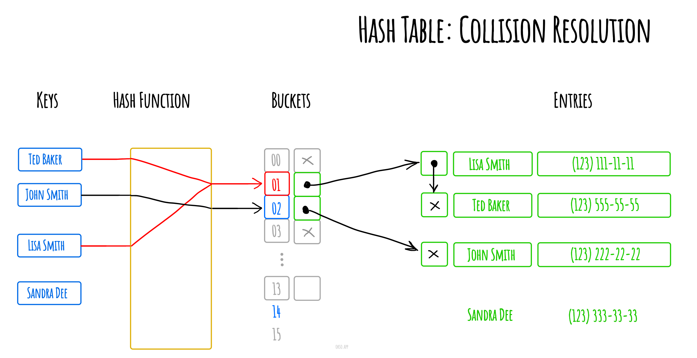

# 哈希表

在计算中, 一个  **哈希表(hash table 或hash map)**  是一种实现 *关联数组(associative array)*
的抽象数据类型, 该结构可以将 *键映射到值*。

哈希表使用 *哈希函数/散列函数* 来计算一个值在数组或桶(buckets)中或槽(slots)中对应的索引,可使用该索引找到所需的值。

理想情况下,散列函数将为每个键分配给一个唯一的桶(bucket),但是大多数哈希表设计采用不完美的散列函数,这可能会导致"哈希冲突(hash collisions)",也就是散列函数为多个键(key)生成了相同的索引,这种碰撞必须
以某种方式进行处理。


通过单独的链接解决哈希冲突



```js
class HashTable {
  constructor() {
    this.table = {};
  }

  // 哈希函数
  hash(key) {
    let hash = 0;
    for (let i = 0; i < key.length; i++) {
      hash += key.charCodeAt(i);
    }
    return hash % 37; // 选择一个适当的哈希表大小，如质数
  }

  // 向哈希表中插入键值对
  put(key, value) {
    const index = this.hash(key);
    if (!this.table[index]) {
      this.table[index] = {};
    }
    this.table[index][key] = value;
  }

  // 从哈希表中获取指定键的值
  get(key) {
    const index = this.hash(key);
    if (this.table[index] && this.table[index][key]) {
      return this.table[index][key];
    }
    return undefined;
  }

  // 从哈希表中移除指定键值对
  remove(key) {
    const index = this.hash(key);
    if (this.table[index] && this.table[index][key]) {
      delete this.table[index][key];
      if (Object.keys(this.table[index]).length === 0) {
        delete this.table[index];
      }
      return true;
    }
    return false;
  }

  // 检查哈希表中是否存在指定键
  contains(key) {
    const index = this.hash(key);
    return !!(this.table[index] && this.table[index][key]);
  }

  // 返回哈希表中的所有键
  keys() {
    const keys = [];
    for (const index in this.table) {
      for (const key in this.table[index]) {
        keys.push(key);
      }
    }
    return keys;
  }

  // 返回哈希表中的所有值
  values() {
    const values = [];
    for (const index in this.table) {
      for (const key in this.table[index]) {
        values.push(this.table[index][key]);
      }
    }
    return values;
  }
}
```


```js
const hashTable = new HashTable();
hashTable.put("apple", 10);
hashTable.put("banana", 20);
console.log(hashTable.get("apple")); // 输出: 10
console.log(hashTable.contains("banana")); // 输出: true
console.log(hashTable.remove("banana")); // 输出: true
console.log(hashTable.contains("banana")); // 输出: false
console.log(hashTable.keys()); // 输出: ["apple"]
console.log(hashTable.values()); // 输出: [10]
```

## 参考

- [Wikipedia](https://en.wikipedia.org/wiki/Hash_table)
- [YouTube](https://www.youtube.com/watch?v=shs0KM3wKv8&index=4&list=PLLXdhg_r2hKA7DPDsunoDZ-Z769jWn4R8)
