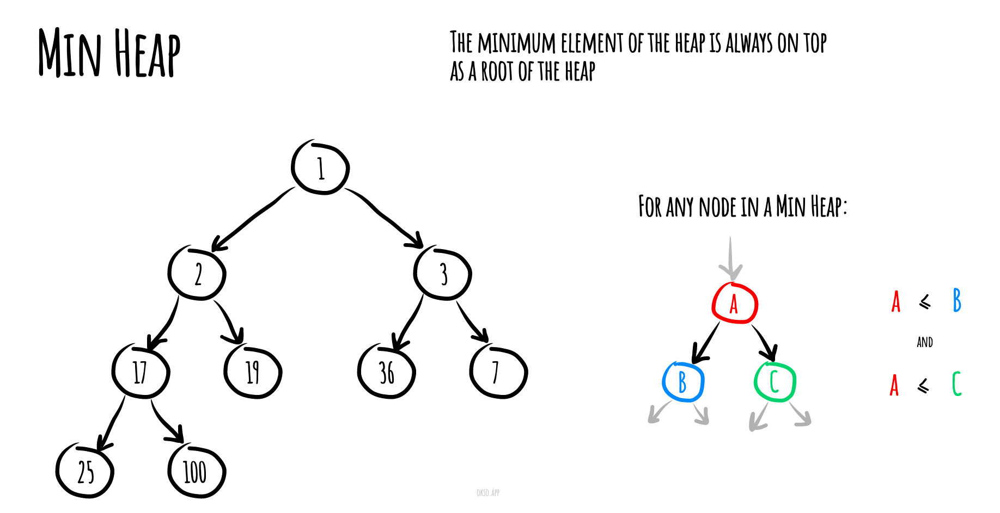

# 堆

> 详见[堆排序章节](/lc/algorithms/sorting/heap-sort/)

在计算机科学中, 一个 **堆(heap)** 是一种特殊的基于树的数据结构，它满足下面描述的堆属性。

在一个 *最小堆(min heap)* 中, 如果 `P` 是 `C` 的一个父级节点, 那么 `P`  的key(或value)应小于或等于 `C` 的对应值.




在一个  *最大堆(max heap)* 中,  `P` 的key(或value)大于 `C` 的对应值。


在堆“顶部”的没有父级节点的节点,被称之为根节点。


## 最小堆

```js
class MinHeap {
  constructor() {
    this.heap = [];
  }

  // 获取父节点的索引
  getParentIndex(index) {
    return Math.floor((index - 1) / 2);
  }

  // 获取左子节点的索引
  getLeftChildIndex(index) {
    return 2 * index + 1;
  }

  // 获取右子节点的索引
  getRightChildIndex(index) {
    return 2 * index + 2;
  }

  // 交换元素位置
  swap(index1, index2) {
    [this.heap[index1], this.heap[index2]] = [this.heap[index2], this.heap[index1]];
  }

  // 上移操作（向上调整堆）
  siftUp(index) {
    if (index === 0) {
      return;
    }

    const parentIndex = this.getParentIndex(index);
    if (this.heap[parentIndex] > this.heap[index]) {
      this.swap(parentIndex, index);
      this.siftUp(parentIndex);
    }
  }

  // 下移操作（向下调整堆）
  siftDown(index) {
    const leftChildIndex = this.getLeftChildIndex(index);
    const rightChildIndex = this.getRightChildIndex(index);
    let minIndex = index;

    if (leftChildIndex < this.heap.length && this.heap[leftChildIndex] < this.heap[minIndex]) {
      minIndex = leftChildIndex;
    }

    if (rightChildIndex < this.heap.length && this.heap[rightChildIndex] < this.heap[minIndex]) {
      minIndex = rightChildIndex;
    }

    if (minIndex !== index) {
      this.swap(index, minIndex);
      this.siftDown(minIndex);
    }
  }

  // 插入元素到堆中
  insert(value) {
    this.heap.push(value);
    this.siftUp(this.heap.length - 1);
  }

  // 获取堆顶元素（最小值）
  peek() {
    if (this.heap.length === 0) {
      return null;
    }
    return this.heap[0];
  }

  // 删除堆顶元素（最小值）
  remove() {
    if (this.heap.length === 0) {
      return null;
    }

    const minValue = this.heap[0];
    const lastValue = this.heap.pop();

    if (this.heap.length > 0) {
      this.heap[0] = lastValue;
      this.siftDown(0);
    }

    return minValue;
  }

  // 获取堆的大小
  size() {
    return this.heap.length;
  }
}
```

## 最大堆


```js
class MaxHeap {
  constructor() {
    this.heap = [];
  }

  // 获取父节点的索引
  getParentIndex(index) {
    return Math.floor((index - 1) / 2);
  }

  // 获取左子节点的索引
  getLeftChildIndex(index) {
    return 2 * index + 1;
  }

  // 获取右子节点的索引
  getRightChildIndex(index) {
    return 2 * index + 2;
  }

  // 交换元素位置
  swap(index1, index2) {
    [this.heap[index1], this.heap[index2]] = [this.heap[index2], this.heap[index1]];
  }

  // 上移操作（向上调整堆）
  siftUp(index) {
    if (index === 0) {
      return;
    }

    const parentIndex = this.getParentIndex(index);
    if (this.heap[parentIndex] < this.heap[index]) {
      this.swap(parentIndex, index);
      this.siftUp(parentIndex);
    }
  }

  // 下移操作（向下调整堆）
  siftDown(index) {
    const leftChildIndex = this.getLeftChildIndex(index);
    const rightChildIndex = this.getRightChildIndex(index);
    let maxIndex = index;

    if (leftChildIndex < this.heap.length && this.heap[leftChildIndex] > this.heap[maxIndex]) {
      maxIndex = leftChildIndex;
    }

    if (rightChildIndex < this.heap.length && this.heap[rightChildIndex] > this.heap[maxIndex]) {
      maxIndex = rightChildIndex;
    }

    if (maxIndex !== index) {
      this.swap(index, maxIndex);
      this.siftDown(maxIndex);
    }
  }

  // 插入元素到堆中
  insert(value) {
    this.heap.push(value);
    this.siftUp(this.heap.length - 1);
  }

  // 获取堆顶元素（最大值）
  peek() {
    if (this.heap.length === 0) {
      return null;
    }
    return this.heap[0];
  }

  // 删除堆顶元素（最大值）
  remove() {
    if (this.heap.length === 0) {
      return null;
    }

    const maxValue = this.heap[0];
    const lastValue = this.heap.pop();

    if (this.heap.length > 0) {
      this.heap[0] = lastValue;
      this.siftDown(0);
    }

    return maxValue;
  }

  // 获取堆的大小
  size() {
    return this.heap.length;
  }
}
```

## 参考

- [Wikipedia](https://en.wikipedia.org/wiki/Heap_(data_structure))
- [YouTube](https://www.youtube.com/watch?v=t0Cq6tVNRBA&index=5&t=0s&list=PLLXdhg_r2hKA7DPDsunoDZ-Z769jWn4R8)
