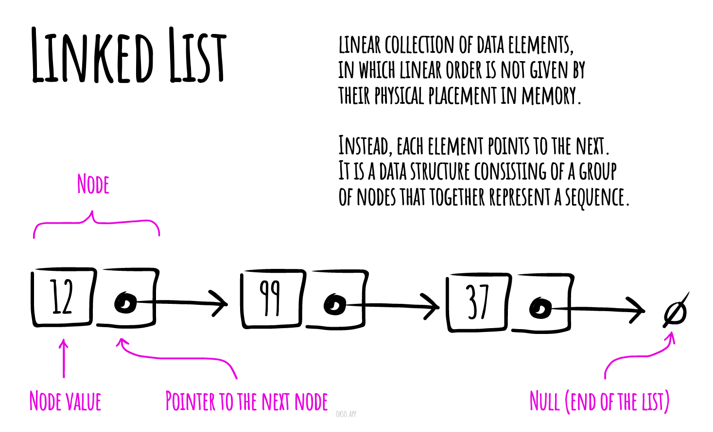

# 链表

在计算机科学中，链表是一种数据结构，用于存储和组织元素的集合。与数组不同，链表中的元素不是按照它们在内存中的物理位置顺序存储的。相反，每个元素都包含一个指向下一个元素的引用。链表由一系列节点组成，这些节点一起表示一个序列。

链表最简单的形式是每个节点包含数据和指向下一个节点的引用。这种结构允许在迭代过程中高效地在任何位置插入或删除元素。

更复杂的链表变体添加了额外的链接，允许高效地插入或删除任意元素的引用。链表的一个缺点是访问元素的时间复杂度是线性的（难以进行快速随机访问），而数组具有更好的缓存局部性。

链表的实现通常涉及两个主要的类：LinkedListNode（链表节点）和LinkedList（链表）。




## 链表节点（LinkedListNode）

链表节点表示链表中的一个元素，它包含一个值和一个指向下一个节点的引用。它的实现可以参考下面的代码：

```js
export default class LinkedListNode {
  constructor(value, next = null) {
    this.value = value; // 节点的值
    this.next = next; // 指向下一个节点的引用
  }

  toString(callback) {
    return callback ? callback(this.value) : `${this.value}`;
  }
}
```

## 链表（LinkedList）

链表是由一系列链表节点组成的数据结构。它具有一个头节点（head）和一个尾节点（tail），分别表示链表的开头和结尾。

链表类提供了一系列方法来操作链表，如在开头插入节点（prepend）、在末尾插入节点（append）、在指定位置插入节点（insert）、删除节点（delete）、查找节点（find）等。以下是链表类的实现代码：

```js
import LinkedListNode from './LinkedListNode';
import Comparator from '../../utils/comparator/Comparator';

export default class LinkedList {
  constructor(comparatorFunction) {
    this.head = null; // 头节点
    this.tail = null; // 尾节点
    this.compare = new Comparator(comparatorFunction); // 比较器
  }

  // 在链表开头插入节点
  prepend(value) {
    const newNode = new LinkedListNode(value, this.head);
    this.head = newNode;

    if (!this.tail) {
      this.tail = newNode;
    }

    return this;
  }

  // 在链表末尾插入节点
  append(value) {
    const newNode = new LinkedListNode(value);

    if (!this.head) {
      this.head = newNode;
      this.tail = newNode;
      return this;
    }

    this.tail.next = newNode;
    this.tail = newNode;

    return this;
  }

  // 在指定位置插入节点
  insert(value, index) {
    const newNode = new LinkedListNode(value);

    if (index === 0) {
      this.prepend(value);
    } else {
      let count = 1;
      let currentNode = this.head;

      while (currentNode) {
        if (count === index) {
          break;
        }
        currentNode = currentNode.next;
        count += 1;
      }

      if (currentNode) {
        newNode.next = currentNode.next;
        currentNode.next = newNode;
      } else {
        if (this.tail) {
          this.tail.next = newNode;
          this.tail = newNode;
        } else {
          this.head = newNode;
          this.tail = newNode;
        }
      }
    }

    return this;
  }

  // 删除节点
  delete(value) {
    if (!this.head) {
      return null;
    }

    let deletedNode = null;

    while (this.head && this.compare.equal(this.head.value, value)) {
      deletedNode = this.head;
      this.head = this.head.next;
    }

    let currentNode = this.head;

    if (currentNode !== null) {
      while (currentNode.next) {
        if (this.compare.equal(currentNode.next.value, value)) {
          deletedNode = currentNode.next;
          currentNode.next = currentNode.next.next;
        } else {
          currentNode = currentNode.next;
        }
      }
    }

    if (this.compare.equal(this.tail.value, value)) {
      this.tail = currentNode;
    }

    return deletedNode;
  }

  // 查找节点
  find({ value = undefined, callback = undefined }) {
    if (!this.head) {
      return null;
    }

    let currentNode = this.head;

    while (currentNode) {
      if (callback && callback(currentNode.value)) {
        return currentNode;
      }

      if (value !== undefined && this.compare.equal(currentNode.value, value)) {
        return currentNode;
      }

      currentNode = currentNode.next;
    }

    return null;
  }

  // 删除尾节点
  deleteTail() {
    const deletedTail = this.tail;

    if (this.head === this.tail) {
      this.head = null;
      this.tail = null;
      return deletedTail;
    }

    let currentNode = this.head;
    while (currentNode.next) {
      if (!currentNode.next.next) {
        currentNode.next = null;
      } else {
        currentNode = currentNode.next;
      }
    }

    this.tail = currentNode;

    return deletedTail;
  }

  // 删除头节点
  deleteHead() {
    if (!this.head) {
      return null;
    }

    const deletedHead = this.head;

    if (this.head.next) {
      this.head = this.head.next;
    } else {
      this.head = null;
      this.tail = null;
    }

    return deletedHead;
  }

  // 将数组转换为链表
  fromArray(values) {
    values.forEach((value) => this.append(value));

    return this;
  }

  // 将链表转换为数组
  toArray() {
    const nodes = [];
    let currentNode = this.head;

    while (currentNode) {
      nodes.push(currentNode);
      currentNode = currentNode.next;
    }

    return nodes;
  }

  // 将链表转换为字符串
  toString(callback) {
    return this.toArray().map((node) => node.toString(callback)).toString();
  }

  // 反转链表
  reverse() {
    let currNode = this.head;
    let prevNode = null;
    let nextNode = null;

    while (currNode) {
      nextNode = currNode.next;
      currNode.next = prevNode;
      prevNode = currNode;
     

      currNode = nextNode;
    }

    this.tail = this.head;
    this.head = prevNode;

    return this;
  }
}
```

## 复杂度

链表的时间复杂度如下：

- 访问：O(n)
- 搜索：O(n)
- 插入：O(1)
- 删除：O(1)

链表的空间复杂度为O(n)，其中n是链表中的节点数。

## 参考资料

- [Wikipedia](https://en.wikipedia.org/wiki/Linked_list)
- [YouTube](https://www.youtube.com/watch?v=njTh_OwMljA&index=2&t=1s&list=PLLXdhg_r2hKA7DPDsunoDZ-Z769jWn4R8)