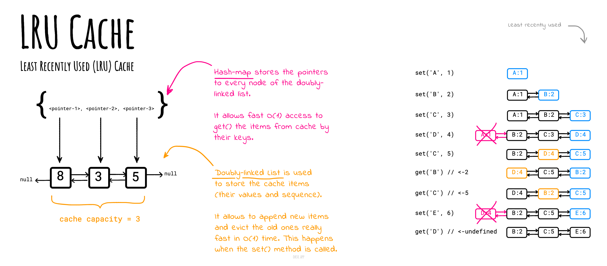

# LRU

**最近最少使用（LRU）缓存**按使用顺序组织项目，允许您快速识别最长时间未使用的项目。

想象一下衣服架，衣服总是挂在一边。要找到最近最少使用的项目，请查看架子的另一端的项目。

## 问题描述

实现LRUCache类：

- `LRUCache(int capacity)` 使用**正数**大小`capacity`初始化LRU缓存。
- `int get(int key)` 如果存在`key`，则返回`key`的值，否则返回`undefined`。
- `void set(int key, int value)` 如果存在`key`，则更新`key`的值。否则，将`key-value`对添加到缓存中。如果此操作导致键的数量超过`capacity`，则**删除**最近最少使用的键。

函数`get()`和`set()`的平均时间复杂度必须为`O(1)`。

## 实现

### 版本1：双向链表 + 哈希映射

请参阅[LRUCache.js](./LRUCache.js)中的`LRUCache`实现示例。该解决方案使用`HashMap`快速访问缓存项（平均时间复杂度为`O(1)`）和`DoublyLinkedList`快速推广和驱逐缓存项（以保持最大允许的缓存容量，平均时间复杂度为`O(1)`）。

*使用[okso.app](https://okso.app)制作*

您还可以在[LRUCache.test.js](./__test__/LRUCache.test.js)文件中找到更多LRU缓存的工作方式的测试用例示例。

### 版本2：有序映射

第一个使用双向链表的实现方法对于学习目的和更好地理解如何在进行`set()`和`get()`时实现平均`O(1)`时间复杂度是很好的。

然而，更简单的方法可能是使用JavaScript的[Map](https://developer.mozilla.org/en-US/docs/Web/JavaScript/Reference/Global_Objects/Map)对象。`Map`对象保存键值对，并通过记住键的原始插入顺序来**保持原始顺序**。我们可以利用这一点，通过删除和重新添加项来将最近使用的项保持在映射的“末尾”。如果缓存容量溢出，位于`Map`开头的项将首先被驱逐。可以使用`map.keys()`之类的`IterableIterator`来检查项的顺序。

请参阅[LRUCacheOnMap.js](./LRUCacheOnMap.js)中的`LRUCacheOnMap`实现示例。

您还可以在[LRUCacheOnMap.test.js](./__test__/LRUCacheOnMap.test.js)文件中找到更多LRU缓存的工作方式的测试用例示例。

## 复杂度

|   | 平均 |
|---|---|
| 空间 | `O(n)` |
| 获取项 | `O(1)` |
| 设置项 | `O(1)` |

## 参考资料

- [LeetCode上的LRU Cache](https://leetcode.com/problems/lru-cache/solutions/244744/lru-cache/)
- [InterviewCake上的LRU Cache](https://www.interviewcake.com/concept/java/lru-cache)
- [维基百科上的LRU Cache](https://en.wikipedia.org/wiki/Cache_replacement_policies)