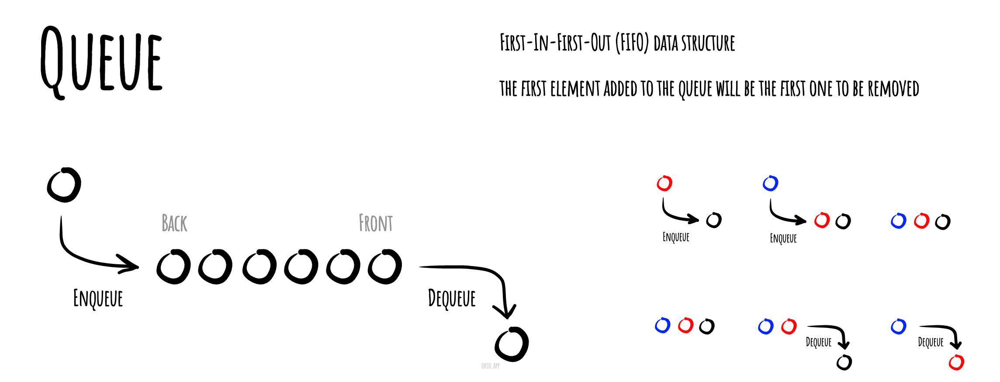

# 队列

在计算机科学中, 一个 **队列(queue)** 是一种特殊类型的抽象数据类型或集合。集合中的实体按顺序保存。

队列基本操作有两种：入队和出队。从队列的后端位置添加实体，称为入队；从队列的前端位置移除实体，称为出队。


队列中元素先进先出 FIFO (first in, first out)的示意




## 实现队列

```js
class Queue {
  constructor() {
    this.items = [];
  }

  // 入队操作
  enqueue(element) {
    this.items.push(element);
  }

  // 出队操作
  dequeue() {
    if (this.isEmpty()) {
      throw new Error("Queue is empty");
    }
    return this.items.shift();
  }

  // 返回队头元素
  front() {
    if (this.isEmpty()) {
      throw new Error("Queue is empty");
    }
    return this.items[0];
  }

  // 判断队列是否为空
  isEmpty() {
    return this.items.length === 0;
  }

  // 返回队列的大小
  size() {
    return this.items.length;
  }

  // 清空队列
  clear() {
    this.items = [];
  }
}

```

```js
const queue = new Queue();
queue.enqueue(10);
queue.enqueue(20);
queue.enqueue(30);
console.log(queue.front()); // 输出: 10
console.log(queue.size()); // 输出: 3
console.log(queue.isEmpty()); // 输出: false
queue.dequeue();
console.log(queue.size()); // 输出: 2
queue.clear();
console.log(queue.isEmpty()); // 输出: true
```

## 参考

- [Wikipedia](https://en.wikipedia.org/wiki/Queue_(abstract_data_type))
- [YouTube](https://www.youtube.com/watch?v=wjI1WNcIntg&list=PLLXdhg_r2hKA7DPDsunoDZ-Z769jWn4R8&index=3&)
