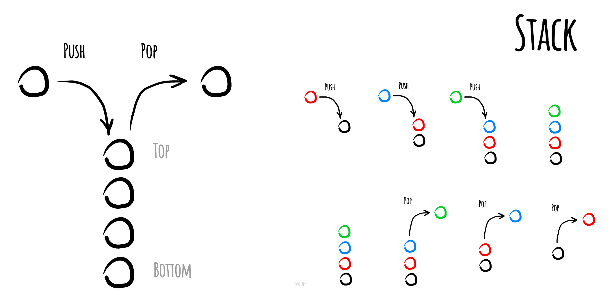

# 栈

在计算机科学中, 一个 **栈(stack)** 是一种抽象数据类型,用作表示元素的集合,具有两种主要操作:

* **push**, 添加元素到栈的顶端(末尾);
* **pop**, 移除栈最顶端(末尾)的元素.

以上两种操作可以简单概括为“后进先出(LIFO = last in, first out)”。

此外,应有一个 `peek` 操作用于访问栈当前顶端(末尾)的元素。

"栈"这个名称,可类比于一组物体的堆叠(一摞书,一摞盘子之类的)。

栈的 push 和 pop 操作的示意



## 实现栈

```js
import LinkedList from '../linked-list/LinkedList';

export default class Stack {
  constructor() {
    // We're going to implement Stack based on LinkedList since these
    // structures are quite similar. Compare push/pop operations of the Stack
    // with prepend/deleteHead operations of LinkedList.
    // 用数组代替链表也行
    this.linkedList = new LinkedList();
  }

  /**
   * @return {boolean}
   */
  isEmpty() {
    // The stack is empty if its linked list doesn't have a head.
    return !this.linkedList.head;
  }

  /**
   * @return {*}
   */
  peek() {
    if (this.isEmpty()) {
      // If the linked list is empty then there is nothing to peek from.
      return null;
    }

    // Just read the value from the start of linked list without deleting it.
    return this.linkedList.head.value;
  }

  /**
   * @param {*} value
   */
  push(value) {
    // Pushing means to lay the value on top of the stack. Therefore let's just add
    // the new value at the start of the linked list.
    this.linkedList.prepend(value);
  }

  /**
   * @return {*}
   */
  pop() {
    // Let's try to delete the first node (the head) from the linked list.
    // If there is no head (the linked list is empty) just return null.
    const removedHead = this.linkedList.deleteHead();
    return removedHead ? removedHead.value : null;
  }

  /**
   * @return {*[]}
   */
  toArray() {
    return this.linkedList
      .toArray()
      .map((linkedListNode) => linkedListNode.value);
  }

  /**
   * @param {function} [callback]
   * @return {string}
   */
  toString(callback) {
    return this.linkedList.toString(callback);
  }
}
```

## 参考

- [Wikipedia](https://en.wikipedia.org/wiki/Stack_(abstract_data_type))
- [YouTube](https://www.youtube.com/watch?v=wjI1WNcIntg&list=PLLXdhg_r2hKA7DPDsunoDZ-Z769jWn4R8&index=3&)
