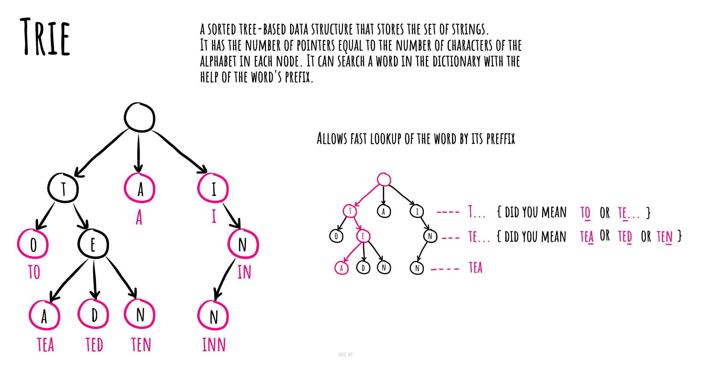

# 字典树

在计算机科学中, **字典树(trie,中文又被称为”单词查找树“或 ”键树“)**, 也称为数字树,有时候也被称为基数树或前缀树（因为它们可以通过前缀搜索）,它是一种搜索树--一种已排序的数据结构,通常用于存储动态集或键为字符串的关联数组。

与二叉搜索树不同, 树上没有节点存储与该节点关联的键; 相反,节点在树上的位置定义了与之关联的键。一个节点的全部后代节点都有一个与该节点关联的通用的字符串前缀, 与根节点关联的是空字符串。

值对于字典树中关联的节点来说,不是必需的,相反,值往往和相关的叶子相关,以及与一些键相关的内部节点相关。

有关字典树的空间优化示意,请参阅紧凑前缀树




## TrieNode

```js
import HashTable from '../hash-table/HashTable';

export default class TrieNode {
  /**
   * @param {string} character
   * @param {boolean} isCompleteWord
   */
  constructor(character, isCompleteWord = false) {
    this.character = character;
    this.isCompleteWord = isCompleteWord;
    this.children = new HashTable();
  }

  /**
   * @param {string} character
   * @return {TrieNode}
   */
  getChild(character) {
    return this.children.get(character);
  }

  /**
   * @param {string} character
   * @param {boolean} isCompleteWord
   * @return {TrieNode}
   */
  addChild(character, isCompleteWord = false) {
    if (!this.children.has(character)) {
      this.children.set(character, new TrieNode(character, isCompleteWord));
    }

    const childNode = this.children.get(character);

    // In cases similar to adding "car" after "carpet" we need to mark "r" character as complete.
    childNode.isCompleteWord = childNode.isCompleteWord || isCompleteWord;

    return childNode;
  }

  /**
   * @param {string} character
   * @return {TrieNode}
   */
  removeChild(character) {
    const childNode = this.getChild(character);

    // Delete childNode only if:
    // - childNode has NO children,
    // - childNode.isCompleteWord === false.
    if (
      childNode
      && !childNode.isCompleteWord
      && !childNode.hasChildren()
    ) {
      this.children.delete(character);
    }

    return this;
  }

  /**
   * @param {string} character
   * @return {boolean}
   */
  hasChild(character) {
    return this.children.has(character);
  }

  /**
   * Check whether current TrieNode has children or not.
   * @return {boolean}
   */
  hasChildren() {
    return this.children.getKeys().length !== 0;
  }

  /**
   * @return {string[]}
   */
  suggestChildren() {
    return [...this.children.getKeys()];
  }

  /**
   * @return {string}
   */
  toString() {
    let childrenAsString = this.suggestChildren().toString();
    childrenAsString = childrenAsString ? `:${childrenAsString}` : '';
    const isCompleteString = this.isCompleteWord ? '*' : '';

    return `${this.character}${isCompleteString}${childrenAsString}`;
  }
}

```

## Trie


```js
import TrieNode from './TrieNode';

// Character that we will use for trie tree root.
const HEAD_CHARACTER = '*';

export default class Trie {
  constructor() {
    this.head = new TrieNode(HEAD_CHARACTER);
  }

  /**
   * @param {string} word
   * @return {Trie}
   */
  addWord(word) {
    const characters = Array.from(word);
    let currentNode = this.head;

    for (let charIndex = 0; charIndex < characters.length; charIndex += 1) {
      const isComplete = charIndex === characters.length - 1;
      currentNode = currentNode.addChild(characters[charIndex], isComplete);
    }

    return this;
  }

  /**
   * @param {string} word
   * @return {Trie}
   */
  deleteWord(word) {
    const depthFirstDelete = (currentNode, charIndex = 0) => {
      if (charIndex >= word.length) {
        // Return if we're trying to delete the character that is out of word's scope.
        return;
      }

      const character = word[charIndex];
      const nextNode = currentNode.getChild(character);

      if (nextNode == null) {
        // Return if we're trying to delete a word that has not been added to the Trie.
        return;
      }

      // Go deeper.
      depthFirstDelete(nextNode, charIndex + 1);

      // Since we're going to delete a word let's un-mark its last character isCompleteWord flag.
      if (charIndex === (word.length - 1)) {
        nextNode.isCompleteWord = false;
      }

      // childNode is deleted only if:
      // - childNode has NO children
      // - childNode.isCompleteWord === false
      currentNode.removeChild(character);
    };

    // Start depth-first deletion from the head node.
    depthFirstDelete(this.head);

    return this;
  }

  /**
   * @param {string} word
   * @return {string[]}
   */
  suggestNextCharacters(word) {
    const lastCharacter = this.getLastCharacterNode(word);

    if (!lastCharacter) {
      return null;
    }

    return lastCharacter.suggestChildren();
  }

  /**
   * Check if complete word exists in Trie.
   *
   * @param {string} word
   * @return {boolean}
   */
  doesWordExist(word) {
    const lastCharacter = this.getLastCharacterNode(word);

    return !!lastCharacter && lastCharacter.isCompleteWord;
  }

  /**
   * @param {string} word
   * @return {TrieNode}
   */
  getLastCharacterNode(word) {
    const characters = Array.from(word);
    let currentNode = this.head;

    for (let charIndex = 0; charIndex < characters.length; charIndex += 1) {
      if (!currentNode.hasChild(characters[charIndex])) {
        return null;
      }

      currentNode = currentNode.getChild(characters[charIndex]);
    }

    return currentNode;
  }
}

```

## 参考

- [Wikipedia](https://en.wikipedia.org/wiki/Trie)
- [YouTube](https://www.youtube.com/watch?v=zIjfhVPRZCg&list=PLLXdhg_r2hKA7DPDsunoDZ-Z769jWn4R8&index=7&t=0s)
