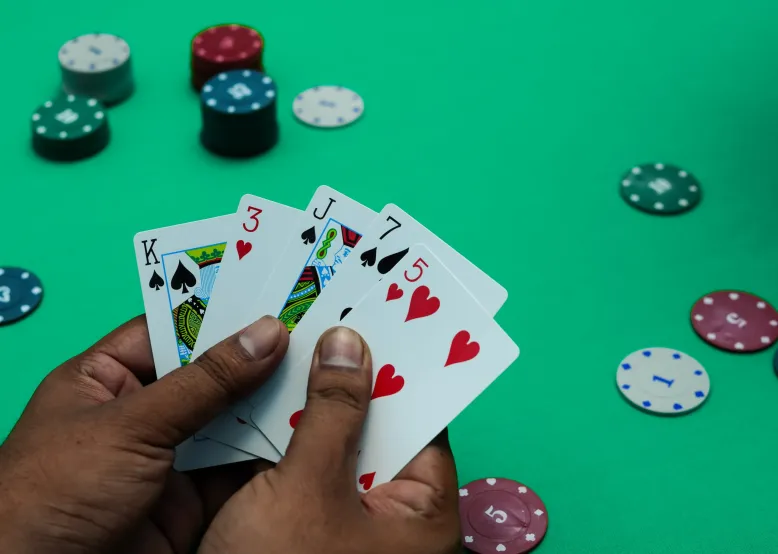

# TS实战之扑克牌排序

[在线运行](https://code.juejin.cn/pen/7254739493366333499)


我们用`ts实现扑克牌排序问题`，首先，我们将定义所需的数据类型，然后专注于模式查找算法，该算法有几个有趣的要点。

## 类型和转换

定义一些我们需要的类型。`Rank`和`Suit`是明显的[联合类型](https://www.typescriptlang.org/docs/handbook/2/everyday-types.html#union-types)。

```ts
type Rank =
 | 'A' | '2' | '3'  | '4' | '5' | '6' | '7'
 | '8' | '9' | '10' | 'J' | 'Q' | 'K'

type Suit = '♥' | '♦' | '♠' | '♣';
```

我们将使用`Card`对象进行处理，将rank和suit转换为数字。卡片将用从1（Ace）到13（King）的值表示，花色从1（红心）到4（梅花）。`rankToNumber()`和`suitToNumber()`函数处理从`Rank`和`Suit`值到数字的转换。

```ts
type Card = { rank: number; suit: number };

const rankToNumber = (rank: Rank): number =>
 rank === 'A'  ? 1
   : rank === 'J' ? 11
   : rank === 'Q' ? 12
   : rank === 'K' ? 13
   : Number(rank);

const suitToNumber = (suit: Suit): number =>
 suit === '♥' ? 1
   : suit === '♦' ? 2
   : suit === '♠' ? 3
   : /* suit === "♣" */ 4;
```


这些类型用于内部工作；我们还必须定义手牌检测算法的结果类型。我们需要一个[枚举](https://www.typescriptlang.org/docs/handbook/enums.html)类型来表示手牌的可能值。这些值按照从最低（"高牌"）到最高（"皇家同花顺"）的顺序排列。

```ts
enum Hand {
 HighCard, // 高牌 
 OnePair, //  一对
 TwoPairs, // 两对
 ThreeOfAKind, // 三条
 Straight, // 顺子
 Flush, // 同花
 FullHouse, //  葫芦
 FourOfAKind, // 四条
 StraightFlush, //  同花顺
 RoyalFlush //皇家同花顺
}
```

## 我们有什么手牌？

让我们首先定义我们将要构建的`handRank()`函数。我们的函数将接收一个包含`五张牌的元组`，并返回一个`Hand`结果。

```ts
export function handRank(
 cardStrings: [string, string, string, string, string]
): Hand {
 .
 .
 .
}
```

由于处理字符串比我们需要的要困难，我们将把牌字符串转换为具有数字`rank`和`suit`值的`Card`对象，以便更容易编写。

```ts
 const cards: Card[] = cardStrings.map((str: string) => ({
   rank: rankToNumber(
     str.substring(0, str.length - 1) as Rank
   ),
   suit: suitToNumber(str.at(-1) as Suit)
 }));
 .
 .
 .
 // 继续...
```




确定玩家手牌的价值的关键在于知道每个等级的牌有多少张，以及我们有多少计数。例如，如果我们有三张J和两张K，J的计数为3，K的计数为2。然后，知道我们有一个计数为三和一个计数为两的计数，我们可以确定我们有一个葫芦。另一个例子：如果我们有两个Q，两个A和一个5，我们会得到两个计数为两和一个计数为一；我们有两对。

生成计数很简单。我们希望A的计数在`countByRank[1]`处，因此我们不会使用`countByRank`数组的初始位置。类似地，花色的计数将位于`countBySuit[1]`到`countBySuit[4]`之间，因此我们也不会使用该数组的初始位置。

```ts
 // ...继续
 .
 .
 .
 const countBySuit = new Array(5).fill(0);
 const countByRank = new Array(15).fill(0);
 const countBySet = new Array(5).fill(0);

 cards.forEach((card: Card) => {
   countByRank[card.rank]++;
   countBySuit[card.suit]++;
 });
 countByRank.forEach(
   (count: number) => count && countBySet[count]++
 );
 .
 .
 .
 // 继续...
```

我们不要忘记A可能位于顺子的开头（A-2-3-4-5）或结尾（10-J-Q-K-A）。我们可以通过在K之后复制Aces计数来处理这个问题。

```ts
 // ...继续
 .
 .
 .
 countByRank[14] = countByRank[1];
 .
 .
 .
 // 继续...
```

现在我们可以开始识别手牌了。我们只需要查看按等级计数即可识别几种手牌：

```ts
 // ...继续
 .
 .
 .
 if (count

BySet[4] === 1 && countBySet[1] === 1)
   return Hand.FourOfAKind;
 else if (countBySet[3] && countBySet[2] === 1)
   return Hand.FullHouse;
 else if (countBySet[3] && countBySet[1] === 2)
   return Hand.ThreeOfAKind;
 else if (countBySet[2] === 2 && countBySet[1] === 1)
   return Hand.TwoPairs;
 else if (countBySet[2] === 1 && countBySet[1] === 3)
   return Hand.OnePair;
 .
 .
 .
 // 继续...
```

例如，如果有四张相同等级的牌，我们知道玩家将获得“四条”。可能会问：如果`countBySet[4] === 1`，为什么还要测试`countBySet[1] === 1`？如果四张牌的等级相同，应该只有一张其他牌，对吗？答案是[“防御性编程”](https://en.wikipedia.org/wiki/Defensive_programming)——在开发代码时，有时会出现错误，通过在测试中更加具体，有助于排查错误。

上面的情况包括了所有某个等级出现多次的可能性。我们必须处理其他情况，包括顺子、同花和“高牌”。

```ts
 // ...继续
 .
 .
 .
 else if (countBySet[1] === 5) {
   if (countByRank.join('').includes('11111'))
     return !countBySuit.includes(5)
       ? Hand.Straight
       : countByRank.slice(10).join('') === '11111'
       ? Hand.RoyalFlush
       : Hand.StraightFlush;
   else {
     return countBySuit.includes(5)
       ? Hand.Flush
       : Hand.HighCard;
   }
 } else {
   throw new Error(
     'Unknown hand! This cannot happen! Bad logic!'
   );
 }
```

这里我们再次进行防御性编程；即使我们知道我们有五个不同的等级，我们也确保逻辑工作良好，甚至在出现问题时抛出一个`throw`。

我们如何测试顺子？我们应该有五个连续的等级。如果我们查看`countByRank`数组，它应该有五个连续的1，所以通过执行`countByRank.join()`并检查生成的字符串是否包含`11111`，我们可以确定是顺子。


我们必须区分几种情况：

*   如果没有五张相同花色的牌，那么它是一个普通的顺子
*   如果所有牌都是相同花色，如果顺子以一张A结束，则为皇家同花顺
*   如果所有牌都是相同花色，但我们不以A结束，那么我们有一个同花顺

如果我们没有顺子，只有两种可能性：

*   如果所有牌都是相同花色，我们有一个同花
*   如果不是所有牌都是相同花色，我们有一个“高牌”

完整的函数如下所示：

```ts
export function handRank(
 cardStrings: [string, string, string, string, string]
): Hand {
 const cards: Card[] = cardStrings.map((str: string) => ({
   rank: rankToNumber(
     str.substring(0, str.length - 1) as Rank
   ),
   suit: suitToNumber(str.at(-1) as Suit)
 }));

 // We won't use the [0] place in the following arrays
 const countBySuit = new Array(5).fill(0);
 const countByRank = new Array(15).fill(0);
 const countBySet = new Array(5).fill(0);

 cards.forEach((card: Card) => {
   countByRank[card.rank]++;
   countBySuit[card.suit]++;
 });
 countByRank.forEach(
   (count: number) => count && countBySet[count]++
 );

 // count the A also as a 14, for straights
 countByRank[14] = countByRank[1];

 if (countBySet[4] === 1 && countBySet[1] === 1)
   return Hand.FourOfAKind;
 else if (countBySet[3] && countBySet[2] === 1)
   return Hand.FullHouse;
 else if (countBySet[3] && countBySet[1] === 2)
   return Hand.ThreeOfAKind;
 else if (countBySet[2] === 2 && countBySet[1] === 1)
   return Hand.TwoPairs;
 else if (countBySet[2] === 1 && countBySet[1] === 3)
   return Hand.OnePair;
 else if (countBySet[1] === 5) {
   if (countByRank.join('').includes('11111'))
     return !countBySuit.includes(5)
       ? Hand.Straight
       : countByRank.slice(10).join('') === '11111'
       ? Hand.RoyalFlush
       : Hand.StraightFlush;
   else {
     /* !countByRank.join("").includes("11111") */
     return countBySuit.includes(5)
       ? Hand.Flush
       : Hand.HighCard;
   }
 } else {
   throw new Error(
     'Unknown hand! This cannot happen! Bad logic!'
   );
 }
}
```

## 测试代码


```ts
console.log(handRank(['3♥', '5♦', '8♣', 'A♥', '6♠'])); // 0
console.log(handRank(['3♥', '5♦', '8♣', 'A♥', '5♠'])); // 1
console.log(handRank(['3♥', '5♦', '3♣', 'A♥', '5♠'])); // 2
console.log(handRank(['3♥', '5♦', '8♣', '5♥', '5♠'])); // 3
console.log(handRank(['3♥', '2♦', 'A♣', '5♥', '4♠'])); // 4
console.log(handRank(['J♥', '10♦', 'A♣', 'Q♥', 'K♠'])); // 4
console.log(handRank(['3♥', '4♦', '7♣', '5♥', '6♠'])); // 4
console.log(handRank(['3♥', '4♥', '9♥', '5♥', '6♥'])); // 5
console.log(handRank(['3♥', '5♦', '3♣', '5♥', '3♠'])); // 6
console.log(handRank(['3♥', '3♦', '3♣', '5♥', '3♠'])); // 7
console.log(handRank(['3♥', '4♥', '7♥', '5♥', '6♥'])); // 8
console.log(handRank(['K♥', 'Q♥', 'A♥', '10♥', 'J♥'])); // 9
```

[在线运行](https://code.juejin.cn/pen/7254739493366333499)


